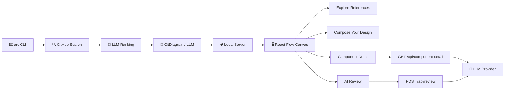

```


                                █████╗ ██████╗  ██████╗
                               ██╔══██╗██╔══██╗██╔════╝
                               ███████║██████╔╝██║
                               ██╔══██║██╔══██╗██║
                               ██║  ██║██║  ██║╚██████╗
                               ╚═╝  ╚═╝╚═╝  ╚═╝ ╚═════╝


```
<h1 align="center">Arc — Architecture Canvas</h1>

<p align="center">
  <b>Design production-grade architectures by learning from real open-source projects.</b><br>
  One command. Real diagrams. Drag, compose, review.
</p>

<p align="center">
  <a href="https://github.com/truecallerabreham/Vibe"></a>
  <a href="https://github.com/truecallerabreham/Vibe/blob/main/LICENSE"></a>
  <a href="#"></a>
  <a href="#"></a>
  <a href="#"></a>
  <a href="#"></a>
</p>

<br>

```bash
arc build "multi-tenant saas with stripe integration"
```

<p align="center">
  <i>↓ Opens an interactive canvas in your browser ↓</i>
</p>

<br>

---

## ✦ One shot. Three seconds. A canvas full of architecture.

Tell Arc what you want to build. It instantly searches GitHub for the most architecturally relevant open-source projects, generates real component diagrams, and opens an interactive canvas where you explore, drag, compose, and get AI-powered reviews.

No mock data. No hallucinated diagrams. **Real architecture from real projects.**

<br>

<div align="center">
  <table>
    <tr>
      <td align="center"><b>🔍 Discover</b></td>
      <td align="center"><b>📐 Diagram</b></td>
      <td align="center"><b>🎨 Compose</b></td>
      <td align="center"><b>🧠 Review</b></td>
    </tr>
    <tr>
      <td>LLM-powered search finds repos that match your idea</td>
      <td>GitDiagram generates real architecture from actual file trees</td>
      <td>Drag components from reference designs onto your canvas</td>
      <td>AI reviews your composed architecture with actionable feedback</td>
    </tr>
  </table>
</div>

<br>

---

## ✦ Quick Start

```bash
# 1. Install
npm install -g arc

# 2. Set your keys (or add to ~/.arcrc)
export GITHUB_TOKEN=ghp_...
export ARC_GROQ_KEY=gsk_...

# 3. Run
arc build "real-time collaborative editor"
```

That's it. A browser opens with architecture diagrams from real open-source projects that solve problems like yours. Click any component for deep analysis. Drag what you like into your own design. Get AI feedback on your composition.

<br>

---

## ✦ Why Arc?

| Without Arc | With Arc |
|---|---|
| You spend hours reading GitHub repos to understand architectures | Arc finds the most relevant ones and diagrams them instantly |
| You guess at component choices and trade-offs | Every component shows why it was chosen, the trade-offs, and alternatives |
| Your architecture is in your head or a napkin | It's an interactive, editable graph |
| You realize design gaps after you start coding | AI reviews your architecture before you write a line of code |

<br>

---

## ✦ Features

<p align="center">
  <b>🧠 Smart Discovery</b> — LLM-powered queries find repos with genuinely similar architecture, ranked by structural relevance<br>
  <b>📊 Real Diagrams</b> — Generated by <a href="https://gitdiagram.com">GitDiagram</a> from actual file trees & READMEs, not AI hallucinations<br>
  <b>🔍 Component Deep-Dive</b> — Click any node for AI analysis: purpose, trade-offs, alternatives, why it was chosen<br>
  <b>🎯 Drag & Drop Canvas</b> — Compose your own architecture by dragging components from reference designs<br>
  <b>⚡ AI Architecture Review</b> — Get structured feedback: strengths, risks, and actionable suggestions<br>
  <b>🔌 Multi-Provider LLM</b> — Supports Groq, OpenRouter, GLM, Gemini — bring your own key<br>
  <b>📦 Offline-First Cache</b> — Results are cached locally in SQLite for instant re-open<br>
</p>

<br>

---

## ✦ Architecture



<details>
<summary><b>📦 Project Structure</b></summary>

```
arc/
├── src/
│   ├── cli/           # Commander CLI (build, discover)
│   ├── diagram/       # GitDiagram SSE client + LLM fallback
│   ├── search/        # GitHub search + query generation + ranking
│   ├── server/        # Express server (API + static web)
│   ├── review/        # Architecture review + component detail
│   ├── cache/         # SQLite-based caching
│   ├── config.ts      # Multi-provider LLM config
│   └── llm.ts         # Unified LLM client
├── web/
│   └── src/           # React + React Flow canvas
│       ├── App.tsx        # Main orchestrator
│       ├── Header.tsx     # Top navigation
│       ├── ReferenceCanvas.tsx  # Reference architecture view
│       ├── DesignCanvas.tsx     # Drag-and-drop design view
│       ├── DraggableNode.tsx    # Custom drag node component
│       ├── ComponentDetailPanel.tsx  # Deep component analysis
│       └── ReviewPanel.tsx    # AI review panel
└── gitdiagram/             # [Optional] GitDiagram backend
```

</details>

<br>

---

## ✦ Configuration

Set these in your environment or add them to `~/.arcrc`:

| Variable | Description | Default |
|---|---|---|
| `ARC_LLM_PROVIDER` | Provider: `groq`, `openrouter`, `glm`, `gemini` | `groq` |
| `ARC_GROQ_KEY` | Groq API key | — |
| `ARC_GROQ_MODEL` | Groq model | `llama-3.3-70b-versatile` |
| `ARC_OPENROUTER_KEY` | OpenRouter API key | — |
| `ARC_OPENROUTER_MODEL` | OpenRouter model | `deepseek/deepseek-chat` |
| `ARC_GLM_KEY` | GLM API key | — |
| `ARC_GEMINI_KEY` | Gemini API key | — |
| `GITHUB_TOKEN` | GitHub PAT (repo scope) | — |
| `ARC_GITDIAGRAM_URL` | GitDiagram instance URL | `http://localhost:3001` |

<details>
<summary><b>📄 ~/.arcrc example</b></summary>

```yaml
llm_provider: groq
groq_key: gsk_...
openrouter_key: sk-or-v1-...
openrouter_model: deepseek/deepseek-chat
glm_key: ...
gemini_key: ...
github_token: ghp_...
gitdiagram_url: http://localhost:3001
```

</details>

<br>

---

## ✦ Usage

```bash
# Discover repos + generate diagrams + open canvas
arc build "customer support ai agent"

# Just find repos (no canvas)
arc discover "video editor backend"

# Help
arc --help
```

### Example: Designing a real-time editor

```bash
arc build "real-time collaborative document editor"
```

1. Arc searches GitHub for repos with collaborative editing architecture
2. Real diagrams are generated via GitDiagram (LLM fallback if unavailable)
3. A browser opens showing 6-10 reference architectures as interactive graphs
4. **Click** any component → see purpose, trade-offs, alternatives, why chosen
5. **Drag** components onto your design canvas to compose your architecture
6. Click **"Review My Architecture"** for AI-powered feedback with strengths, risks, and suggestions

<br>

---

## ✦ Development

```bash
git clone https://github.com/truecallerabreham/Vibe.git
cd arc
npm install
cd web && npm install && cd ..

# Build everything
npm run build:all

# Run tests
npm test

# Type check
npm run typecheck
```

### GitDiagram Backend (optional, for best diagrams)

```bash
cd gitdiagram
cp .env.example .env
# Edit .env with your API keys
cd backend
uv sync
uv run uvicorn app.main:app --host 0.0.0.0 --port 3001
```

Arc auto-detects the backend and falls back to LLM diagrams if unavailable.

<br>

---

## ✦ Tech Stack

<div align="center">

| Layer | Technology |
|---|---|
| **CLI** | Node.js, Commander |
| **LLM Client** | OpenAI SDK (multi-provider) |
| **Search** | GitHub REST API |
| **Cache** | SQLite (better-sqlite3) |
| **Server** | Express |
| **Frontend** | React 18, React Flow, Vite |
| **Diagrams** | GitDiagram (FastAPI/Python) |

</div>

<br>

---

## ✦ Contributing

PRs are welcome. If you have an idea for a feature, open an issue first so we can discuss it.

1. Fork the repo
2. Create your feature branch (`git checkout -b feat/amazing-idea`)
3. Commit your changes (`git commit -m 'feat: add amazing idea'`)
4. Push to the branch (`git push origin feat/amazing-idea`)
5. Open a Pull Request

<br>

---

<div align="center">
  <sub>Built with ❤️ and a lot of ☕. MIT Licensed.</sub>
</div>
