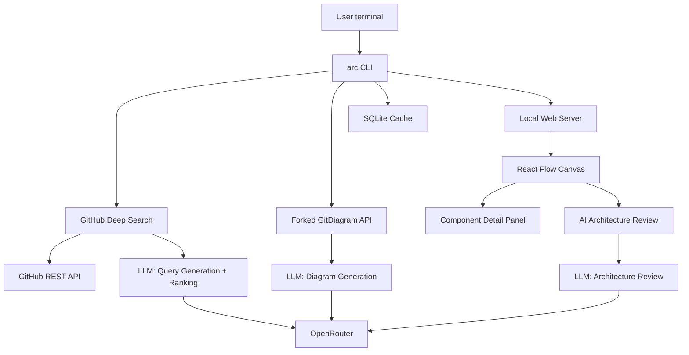

## Goal Capsule

- **Objective:** Build `arc`, a CLI-native tool that lets developers design production-grade architectures by learning from real open-source projects. The user describes their project idea, `arc` finds the most relevant repos, extracts their architectures via a self-hosted GitDiagram fork, displays them side-by-side in a React Flow canvas, and lets the user build their own design by pulling components from reference architectures. Finally, an AI agent reviews the design and suggests improvements with explanations.
- **Stop condition:** `arc` can accept a project description, search GitHub, generate architecture diagrams for matched repos, render them in an interactive canvas, support drag-and-drop component composition, and produce a final architecture review.
- **Tail ownership:** The implementing agent owns all 9 implementation units end-to-end, from project scaffold through final integration test.

## Product Contract

### Summary

A CLI command (`arc build "customer support ai agent"` or `arc discover "video editor"`) that deep-searches GitHub for the most relevant open-source projects matching the user's idea. For each matched repo, it calls a forked GitDiagram API to extract a validated Mermaid architecture diagram. It opens a local web canvas showing reference architectures side-by-side with a central "Design Your System" workspace built on React Flow. Users drag components from reference architectures into their design, inspect deep detail on each component, and finally have their AI agent review the completed design.

### Problem Frame

Developers using AI coding agents (opencode, Claude, Gemini) are given architectures on the fly without understanding why specific components were chosen or whether the design is battle-tested. There is no tool that helps them learn from real, production-proven open-source projects and build an architecture they truly understand — component by component — before writing code.

### Requirements

- R1. The tool accepts a natural-language project description from the CLI.
- R2. The tool searches GitHub for open-source repos relevant to the described project using multiple AI-generated search queries.
- R3. The tool ranks and selects the top 4-6 most architecturally relevant repos.
- R4. For each selected repo, the tool generates a validated architecture diagram using a forked GitDiagram instance.
- R5. The tool displays repo architecture diagrams side-by-side in an interactive web canvas.
- R6. The tool provides a central "Design Your System" canvas where users compose their own architecture.
- R7. Users can drag components from reference architecture diagrams into their own design.
- R8. Each component shows deep detail: purpose, trade-offs, real-world alternatives, and why the original project chose it.
- R9. When the design is complete, the AI agent reviews it and suggests improvements with explanations.
- R10. Generated diagrams and search results are cached to avoid redundant API calls and LLM costs.
- R11. The tool launches the web canvas automatically from the CLI (no manual server start).

### Scope Boundaries

- **Deferred to follow-up work:** Collaborative multi-user editing, CI/CD pipeline integration, exporting to infrastructure-as-code (Terraform, Pulumi), direct code scaffolding from the designed architecture.
- **Outside this product's identity:** The tool does not generate code or implement the user's project. It is an architecture design aid, not a code generator. It does not deploy or host anything.

## Planning Contract

### Key Technical Decisions

- **KTD1. CLI framework:** Use `commander` (Node.js/TypeScript) for CLI argument parsing. TypeScript throughout for type safety. The CLI is the primary interface; the web canvas is an accessory that auto-opens.
- **KTD2. GitDiagram integration:** Fork the MIT-licensed GitDiagram repo, deploy its Next.js backend on a cheap VPS (Railway or Hetzner), and add a programmatic API endpoint (`POST /api/generate` accepting `{ repoUrl, title }` returning Mermaid string + component graph). Use OpenRouter as the LLM provider with `:floor` routing for cheapest provider. Default model: DeepSeek V4 Flash ($0.14/$0.28 per M tokens). Fallback models: Qwen3 Coder, Gemini 2.5 Flash.
- **KTD3. Caching layer:** Use SQLite (via `better-sqlite3`) for local caching of search results and diagram outputs. Keyed by repo URL + branch hash. Cache hit = instant, zero cost. Set a TTL of 7 days for search results, indefinite for diagrams (diagrams are immutable artifacts of a repo snapshot).
- **KTD4. Canvas rendering:** React Flow (`@xyflow/react`) for the web canvas. It is purpose-built for node-based architecture diagrams, each node is a React component, handles drag/drop/zoom/pan/edge routing natively, supports Dagre auto-layout, accepts custom node types with rich detail panels. tldraw was considered but is too free-form for structured architecture design.
- **KTD5. GitHub search pipeline:** The CLI takes user input → calls an LLM to generate 5-10 targeted GitHub search queries → fetches results from `GET /search/repositories` with qualifiers for `stars:>50`, `in:name,description,readme`, sorted by best match → LLM ranks results by architectural relevance to the user's idea → returns top 4-6 repos.
- **KTD6. Component detail:** For each component in a reference architecture diagram, combine: (a) GitDiagram's plain-English architecture explanation, (b) the repo README sections relevant to that component, (c) an AI-generated analysis of the component's purpose, trade-offs, alternatives, and why the pros chose it.
- **KTD7. Architecture review:** After the user finishes designing, send the user's architecture graph (as Mermaid) plus the user's project description to an LLM with a structured prompt requesting: (a) what the architecture does well, (b) gaps or risks, (c) specific suggestions with reasoning. Display results in the canvas as annotation overlays.
- **KTD8. Web server approach:** Embedded Express/Fastify server within the Node.js CLI binary. On `arc build`, the CLI starts a local server on a random port, opens `http://localhost:<port>` in the default browser, and keeps the process alive until the user closes the canvas or presses Ctrl+C.

### High-Level Technical Design

#### Architecture



#### Data Flow

1. User runs `arc build "customer support ai"`
2. CLI sends description to LLM → generates 5-10 search queries
3. CLI fires parallel GitHub API searches → collects candidate repos
4. CLI sends candidates to LLM → ranked by architectural relevance → top 4-6 selected
5. For each selected repo, CLI checks SQLite cache:
   - Cache miss → calls GitDiagram API → stores result in cache
   - Cache hit → returns immediately
6. CLI starts local web server, opens browser
7. React Flow canvas renders reference diagrams (pre-laid-out with Dagre) + empty central canvas
8. User drags components from reference diagrams into their design
9. Each component shows deep detail panel on click
10. User finishes → clicks "Review" → architecture sent to LLM → suggestions displayed

### Assumptions

- OpenRouter account with $10+ credits is sufficient for personal use (diagrams cost ~$0.003 each)
- GitDiagram's MIT license permits forking and extending for this purpose
- The user has Node.js 20+ installed (the CLI runs on Node)
- GitHub API unauthenticated rate limit (60 req/hr) is insufficient; the tool requires a GitHub token (`GITHUB_TOKEN` env var or `gh` auth)

## Implementation Units

### Index

| U-ID | Title | Files | Depends-on |
|------|-------|-------|------------|
| U1 | CLI scaffold and project structure | `package.json`, `src/cli/`, `src/index.ts` | — |
| U2 | GitHub deep search pipeline | `src/search/` | U1 |
| U3 | GitDiagram fork and deployment | Forked repo, `src/diagram/` | U1 |
| U4 | Caching layer | `src/cache/` | U1 |
| U5 | Local web server and React Flow canvas | `src/server/`, `web/` | U1 |
| U6 | Component detail system | `src/components/`, `web/src/components/` | U5 |
| U7 | Architecture review | `src/review/` | U1 |
| U8 | Drag-and-drop composition | `web/src/canvas/` | U5, U6 |
| U9 | Integration and packaging | `README.md`, `scripts/`, test suite | U1-U8 |

---

### U1. CLI scaffold and project structure

**Goal:** Set up the monorepo structure, CLI entry point, configuration loading, and TypeScript toolchain.

**Files:**
- `package.json` — dependencies, scripts
- `tsconfig.json` — TypeScript config
- `src/index.ts` — CLI entry point
- `src/cli/build.ts` — `arc build` command
- `src/cli/discover.ts` — `arc discover` command
- `src/config.ts` — config loading (env vars, `.arcrc`)

**Requirements:** R1

**Approach:** Use `commander` for the CLI. `arc build <description>` is the primary command. `arc discover <description>` just searches and shows repos without opening the canvas. Load config from `~/.arcrc` (YAML) and environment variables (`ARC_OPENROUTER_KEY`, `GITHUB_TOKEN`, `ARC_GITDIAGRAM_URL`).

**Test scenarios:**
1. Running `arc` with no args prints help text
2. Running `arc build "test query"` parses the description and passes it to the search pipeline
3. Missing required env vars produce a clear error message
4. `--help` flag lists all commands and options

**Verification:** `node dist/index.js --help` shows correct output. `node dist/index.js build "test"` logs the parsed description.

---

### U2. GitHub deep search pipeline

**Goal:** Given a project description, find the most architecturally relevant open-source repos on GitHub.

**Files:**
- `src/search/query-generator.ts` — LLM call to generate search queries
- `src/search/github-search.ts` — GitHub REST API fetcher
- `src/search/repo-ranker.ts` — LLM call to rank repos by relevance
- `src/search/types.ts` — types for search results

**Requirements:** R2, R3

**Approach:**
1. `query-generator.ts` sends prompt to OpenRouter: "Generate 8 GitHub search queries for: {description}". Uses `:floor` routing, cheap model (DeepSeek V4 Flash). Prompt instructs it to vary qualifiers (language, topic, stars, activity).
2. `github-search.ts` fires all queries in parallel via `GET /search/repositories`. Requests 30 results per query. Merges and deduplicates. Minimum star threshold: 50.
3. `repo-ranker.ts` sends candidate list to LLM: "Rank these repos by architectural relevance to: {description}. Return top 6 in order." Returns structured JSON.

**Test scenarios:**
1. Query generator produces valid GitHub search queries for "video editor"
2. GitHub search returns results matching at least one query
3. Ranker returns top repos in valid JSON format
4. End-to-end: `arc discover "todo app"` returns 4+ relevant repos within 15 seconds
5. Empty searches produce a user-friendly "no results" message

**Verification:** `arc discover "markdown note taking app"` returns repos like Joplin, Standard Notes, Obsidian-related tools.

---

### U3. GitDiagram fork and deployment

**Goal:** Fork GitDiagram, add a programmatic API, deploy it, and integrate the client into `arc`.

**Files:**
- Forked repo at `github.com/<user>/gitdiagram`
- `src/diagram/client.ts` — HTTP client to the forked API
- `src/diagram/types.ts` — diagram response types
- `src/diagram/processor.ts` — post-processes diagram output (extracts components, builds component graph)

**Requirements:** R4

**Approach:**
1. Fork `ahmedkhaleel2004/gitdiagram` (MIT license)
2. Add a `POST /api/generate` endpoint to the Next.js backend that accepts `{ repoUrl, title, branch? }` and returns `{ mermaid, explanation, components: [{ name, path, description, dependencies }], graphJson }`. This reuses GitDiagram's existing two-stage pipeline but returns structured data instead of HTML.
3. Configure environment for OpenRouter (`OPENROUTER_API_KEY`, `MODEL_PROVIDER=openrouter`, `MODEL_ID=deepseek/deepseek-v4-flash:floor`).
4. Deploy on Railway or Hetzner (~$5-10/month). Simple Dockerfile from GitDiagram's existing config.
5. `client.ts` wraps fetch calls. `processor.ts` parses the component graph from the response.

**Test scenarios:**
1. `GET /api/generate?repo=https://github.com/ahmedkhaleel2004/gitdiagram` returns valid Mermaid
2. Response includes component list with names and paths
3. Error response when repo doesn't exist
4. Response time under 20 seconds for a medium-sized repo (<500 files)
5. Cached responses return instantly (<500ms)

**Verification:** Call the deployed API with a known repo (e.g., FastAPI) and verify the Mermaid output renders correctly.

---

### U4. Caching layer

**Goal:** Local SQLite cache for search results and diagrams to avoid redundant LLM calls.

**Files:**
- `src/cache/store.ts` — SQLite initialization and schema
- `src/cache/search-cache.ts` — search result caching
- `src/cache/diagram-cache.ts` — diagram caching

**Requirements:** R10

**Approach:** SQLite via `better-sqlite3`. Two tables: `search_cache(key TEXT, result TEXT, created_at DATETIME)` and `diagram_cache(repo_url TEXT, branch_hash TEXT, result TEXT, created_at DATETIME)`. Search cache TTL: 7 days. Diagram cache: indefinite (keyed by repo URL + default branch commit hash). During search, check cache first; on cache hit, skip LLM calls entirely and return cached results. During diagram fetch, check cache; on cache miss, call GitDiagram API and store.

**Test scenarios:**
1. First call to `arc discover "markdown notes"` makes API calls; second identical call returns instantly from cache
2. Cache invalidation works after TTL expires
3. Running without a writable cache directory falls back gracefully (no caching, warn user once)

**Verification:** Time the first and second invocation of `arc discover "markdown notes"`. Second should be <1s.

---

### U5. Local web server and React Flow canvas

**Goal:** Start a local web server, serve a React Flow canvas, and auto-open the browser.

**Files:**
- `src/server/index.ts` — Express/Fastify server
- `web/package.json` — Vite + React + React Flow dependencies
- `web/src/App.tsx` — main app component
- `web/src/canvas/ReferenceDiagram.tsx` — renders one repo's diagram
- `web/src/canvas/DesignCanvas.tsx` — central design workspace
- `web/src/canvas/layout.ts` — Dagre auto-layout for diagrams

**Requirements:** R5, R6, R11

**Approach:**
1. Embedded Express server within the Node.js CLI. On `arc build`, start the server on a random port, serve the built React app from `web/dist/`.
2. WebSocket for real-time communication between CLI and canvas (diagram data, configuration).
3. React Flow renders each reference repo's architecture as a sub-graph in a separate area of the canvas (using Dagre for hierarchical layout). The central area is the Design Canvas, initially empty.
4. Top toolbar with repo tabs (one per found repo), "Review" button, export to Mermaid/PNG.

**Test scenarios:**
1. Running `arc build "x"` opens `http://localhost:*` in the default browser
2. Canvas shows 4 reference diagrams laid out with Dagre
3. Zoom, pan, and minimap work
4. "Export as Mermaid" downloads a valid Mermaid file
5. Closing the browser tab or pressing Ctrl+C stops the server

**Verification:** `arc build "api backend"` opens the canvas with reference diagrams rendered and the design workspace visible.

---

### U6. Component detail system

**Goal:** Every component in reference diagrams shows deep detail when clicked.

**Files:**
- `src/components/detail-generator.ts` — AI call to generate component detail
- `web/src/components/ComponentDetailPanel.tsx` — side panel
- `web/src/components/DetailCard.tsx` — individual component detail card

**Requirements:** R8

**Approach:** When a reference repo's diagram is loaded, for each component node, combine three sources:
1. GitDiagram's architecture explanation text (already fetched)
2. Relevant section from repo README (fetched from GitHub API)
3. AI-generated analysis: send component name + architecture context + README excerpt to LLM with prompt: "Explain this component: its purpose, trade-offs, real-world alternatives, and why it was chosen here."

Cache the AI analysis per component (in SQLite, keyed by `repo_url + component_name`).

Display as a slide-out side panel with tabs: "Overview", "Trade-offs", "Alternatives", "Why this was chosen".

**Test scenarios:**
1. Clicking a "PostgreSQL" component in a reference diagram shows a detail panel
2. The detail panel has all four tabs populated
3. Detail for the same component in the same repo on a second load is instant (cached)
4. Components from different repos show distinct details

**Verification:** Click any component in a reference diagram and see a rich detail panel with substantive content within 3 seconds.

---

### U7. Architecture review

**Goal:** AI agent reviews the user's completed architecture and suggests improvements.

**Files:**
- `src/review/reviewer.ts` — LLM call for architecture review
- `src/review/types.ts` — review result types
- `web/src/review/ReviewPanel.tsx` — displays review results in the canvas
- `web/src/review/AnnotationOverlay.tsx` — overlays suggestions on specific components

**Requirements:** R9

**Approach:** When user clicks "Review", collect the user's architecture as Mermaid + component metadata (which components chosen, from which repos, custom notes). Send to LLM (use a capable model like Gemini 2.5 Pro or Claude Sonnet for quality) with structured prompt:
```
You are reviewing a software architecture designed by a developer who learned from real open-source projects.

Architecture: {mermaid}
Project description: {description}
Components chosen: {component list with source repos}

Analyze:
1. What this architecture does well (affirm the user's choices)
2. Gaps, risks, or missing components
3. Specific, actionable suggestions with reasoning
4. Any component choices that may be suboptimal for this use case
```
Return structured JSON. Display as annotation overlays on the user's design canvas.

**Test scenarios:**
1. Review of a simple architecture returns valid feedback with all 4 sections
2. Each suggestion references a specific component or connection
3. Empty architecture returns a "design something first" message
4. Review completes within 15 seconds

**Verification:** Design a simple architecture, click "Review", and see meaningful suggestions with explanations.

---

### U8. Drag-and-drop composition

**Goal:** Users drag components from reference diagrams into their design canvas.

**Files:**
- `web/src/canvas/DragProvider.tsx` — drag-and-drop context
- `web/src/canvas/ComponentPalette.tsx` — component source panel
- `web/src/canvas/DesignCanvas.tsx` — updated with drop handling
- `web/src/canvas/EdgeManager.ts` — connection management

**Requirements:** R7

**Approach:** React Flow's built-in drag-and-drop. Reference diagrams act as source palettes. Users drag a component node from a reference diagram → the component is cloned into the design canvas area with the same styling. The clone carries metadata (source repo, component name, detail data). Users connect components with edges in their design. Components from different reference repos can be mixed freely.

**Test scenarios:**
1. Dragging a "PostgreSQL" component from a reference diagram into the design canvas creates a copy
2. The copy shows the component name and source repo badge
3. Connecting two components with an edge works (drag from output handle to input handle)
4. Deleting a component from the design canvas removes it and its edges
5. Undo/redo works for add, delete, and connect operations

**Verification:** Drag 3 components from 2 different reference repos into the design canvas, connect them, and verify the architecture renders correctly.

---

### U9. Integration and packaging

**Goal:** Package the tool, write docs, and end-to-end test the full flow.

**Files:**
- `README.md` — installation and usage
- `scripts/build.sh` — build script
- `scripts/install.sh` — install script
- `tests/e2e.test.ts` — end-to-end test
- `tests/fixtures/` — test fixtures

**Requirements:** R1-R11

**Approach:** Package as an npm package (`arc`). `npm install -g arc`. Build process: compile TypeScript for CLI, bundle React app with Vite. Publish as a single installable package. `README.md` covers: installation, configuration (env vars), quick start, commands reference, architecture overview.

**Test scenarios:**
1. `npm install -g arc` succeeds on a clean machine
2. `arc build "simple api"` completes the full flow (search → diagram → canvas → compose → review) with a real end-to-end run
3. All errors produce human-readable messages (no stack traces to end users)
4. `arc` works on macOS, Linux, and Windows (Node.js)

**Verification:** Full end-to-end test with a real project description produces a valid architecture canvas with reference diagrams, user composition, and an architecture review.

## Verification Contract

- Unit tests: `npm test` — run Vitest for all unit test scenarios listed per U-ID.
- Type check: `npx tsc --noEmit` — zero type errors.
- Lint: `npx eslint src/ web/src/ --ext .ts,.tsx` — zero warnings.
- E2E test: `npm run test:e2e` — runs the full flow against real GitHub API and a local GitDiagram instance.
- Browser test: `npx playwright test web/` — verifies canvas rendering, drag-and-drop, and review panel.

## Definition of Done

1. All 9 implementation units are implemented and passing their test scenarios.
2. `npm test`, `npx tsc --noEmit`, and `npx eslint` all pass without errors or warnings.
3. A full end-to-end run of `arc build "simple crud api"` produces a canvas with 4+ reference architectures, allows composition, and generates a meaningful architecture review.
4. The tool is installable via `npm install -g arc` and works on macOS, Linux, and Windows.
5. `README.md` documents installation, configuration, and usage with examples.
6. Abandoned-attempt code from approaches that did not pan out is removed — the diff contains only what is needed.
